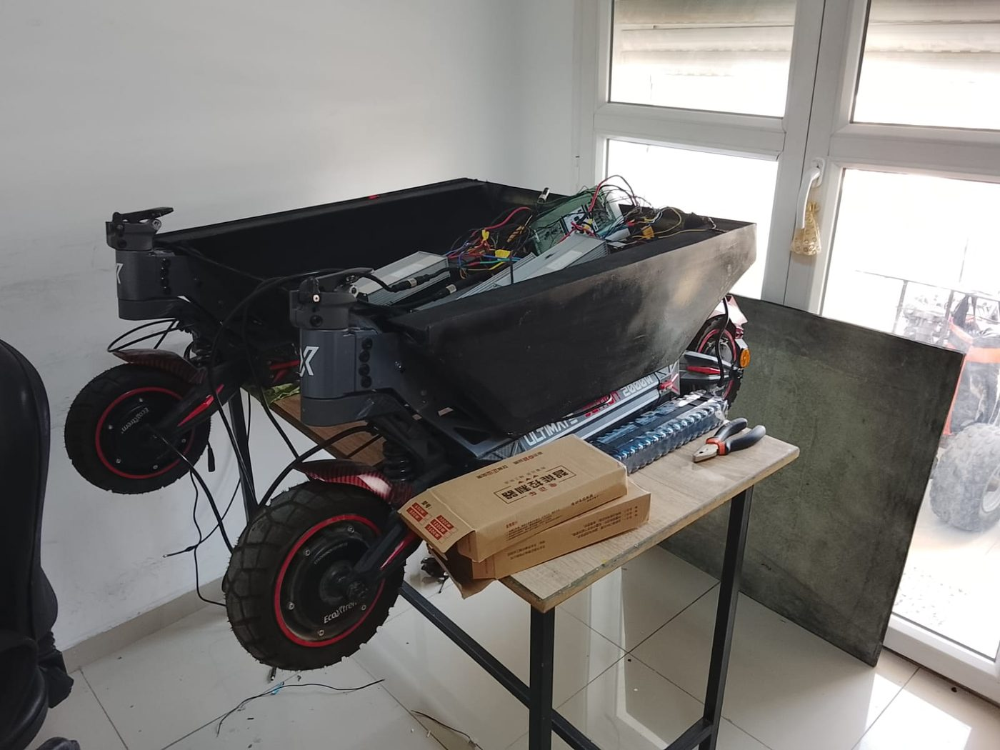
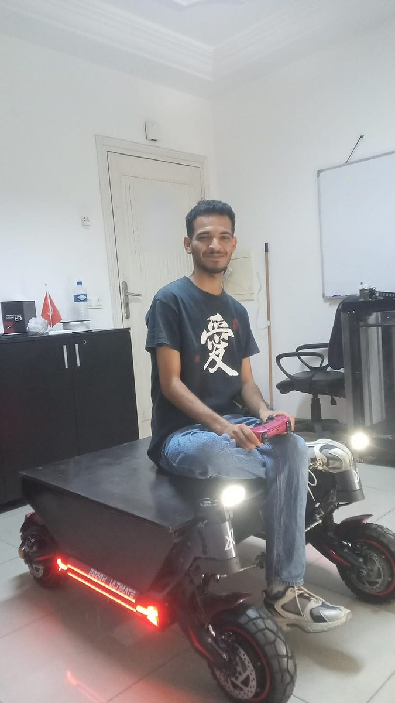
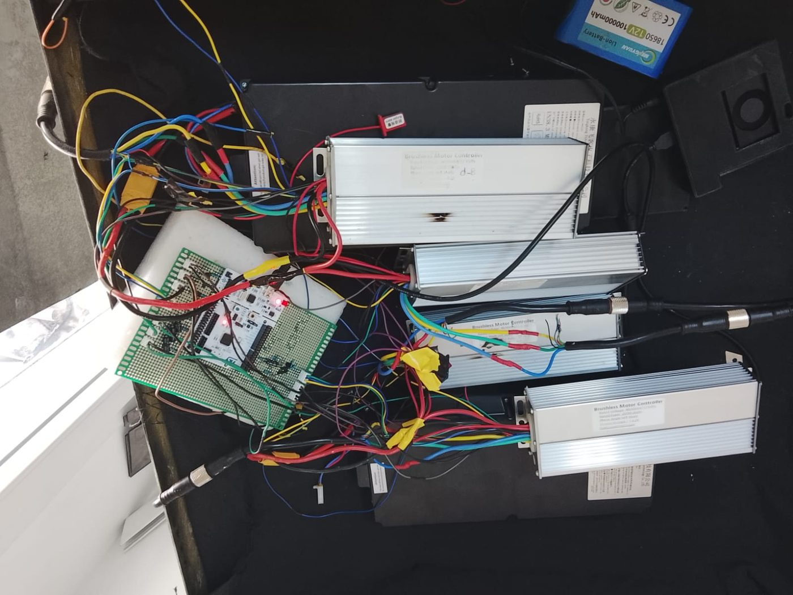
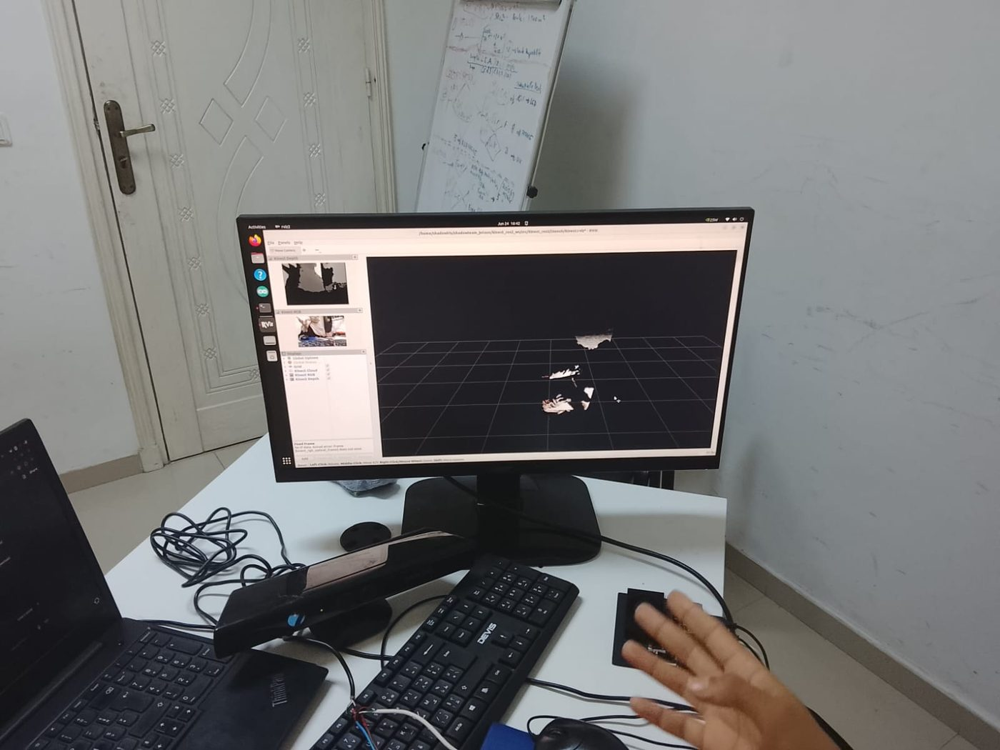
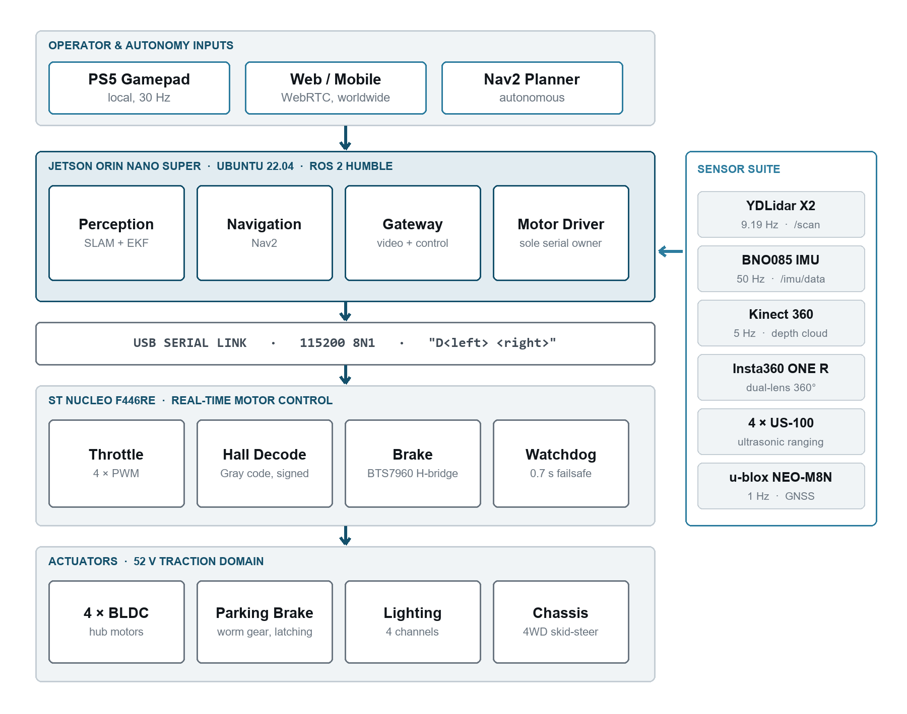
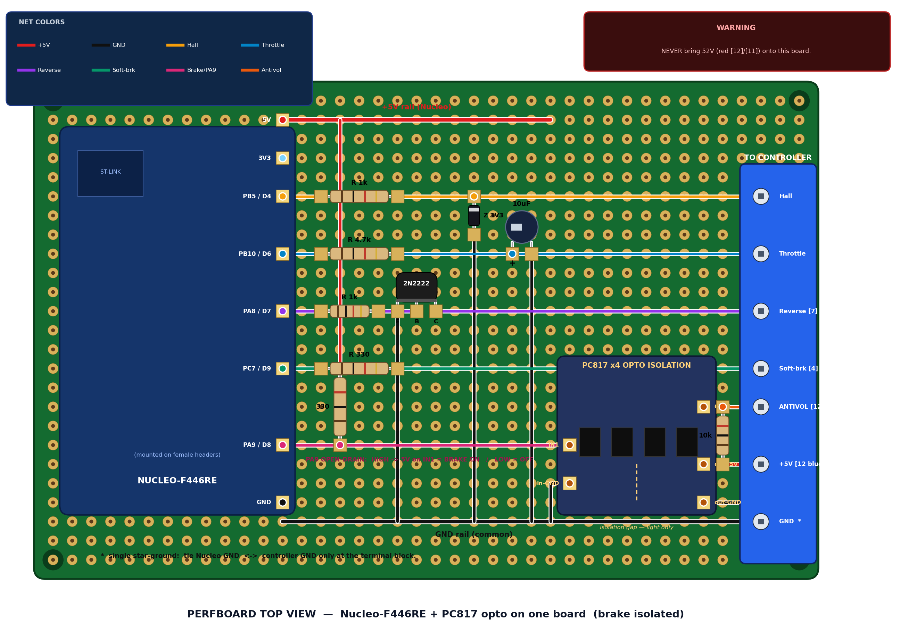
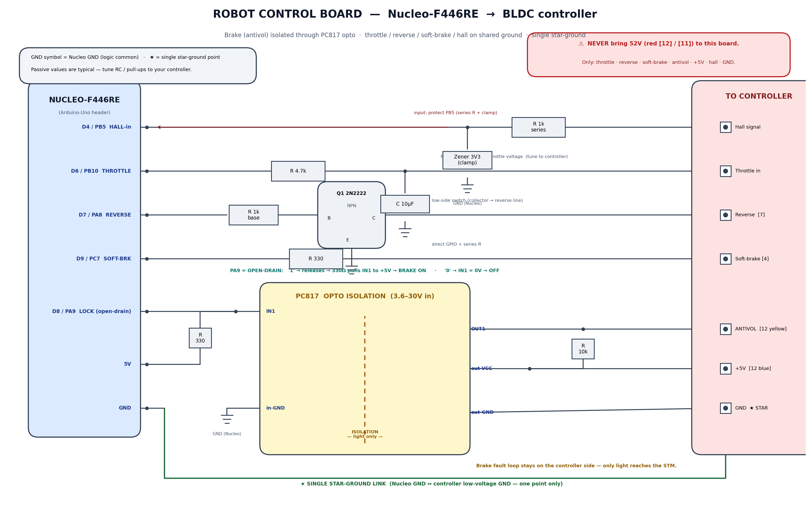
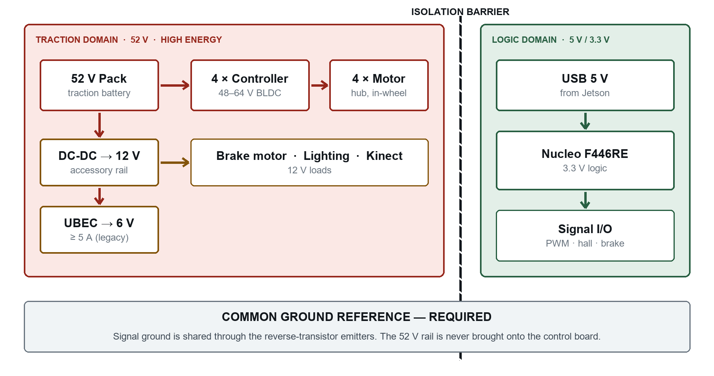

# SHADOW — Autonomous 4WD Ground Vehicle
> NVIDIA Jetson Orin Nano + STM32, ROS 2, lidar and RGB-D perception on a 52 V hub-motor platform.
`2026` · `ROS 2` · `Jetson Orin Nano` · `STM32 F446RE / F401` · `Isaac ROS` · `C` · `Python` · `BLDC` · `Linux`

## Origin

Built at **IRIS Systems** during a 2026 engineering internship, as part of a team working on
the SHADOW autonomous vehicle programme. This repository covers the parts I worked on; the
wider programme is IRIS Systems' project. Published with their agreement.

## About

A full-size four-wheel-drive robot built from scratch: an NVIDIA Jetson Orin Nano as the compute brain, an STM32 Nucleo as the real-time motor MCU, and four generic 48–64 V BLDC hub-motor controllers on a 52 V pack. Throttle and reverse work on all four wheels.

**Motor control.** Each throttle line is filtered through a 1 kΩ + 10 µF RC network into the controller, and each reverse line is driven through a 2N2222 inverter. The controllers only latch reverse at a standstill, so the firmware implements an explicit stop → settle (1000 ms) → reverse-throttle sequence. A bench safety cap limits duty to 216/255 while the wheels are raised. Odometry was calibrated against tape measurements to 0.0090 m per pulse.

**ROS 2 architecture.** I replaced an early monolithic gamepad bridge with a layered, hardware-verified stack: `motor_driver` (subscribes `cmd_vel`, `brake` and `cmd_raw`, holds a 0.5 s watchdog, talks serial to the STM32), `motor_teleop` (DualSense → `cmd_vel`), and `motor_bringup` (launch files and controller config). The old monolith was kept intact as a rollback path.

**Perception.** A YDLidar X2 publishes scans through a ROS 2 driver with tuned parameters — the enable-motor gotcha turned out to be a serial DTR toggle. Two Xbox 360 Kinects supply RGB + depth over libfreenect plus a 4-microphone array via ALSA. On the Orin Nano, DetectNet, ESS stereo depth and U-Net from the Isaac ROS stack were deployed and verified.

**Voice control.** Multilingual (FR / EN / AR) speech nodes map spoken commands directly to `cmd_vel`.

**Localisation.** The Jetson runs Isaac ROS visual SLAM (cuVSLAM) inside a container built from a pinned configuration, so the perception brain is reproducible rather than a hand-tuned install that exists only on one board.

**Developing without the robot.** The whole Jetson software layout is mirrored in a reproducible x86 virtual machine — same workspace structure, same container definition, same environment. It cannot run cuVSLAM, since there is no GPU and the architecture is wrong, and that is fine: what it does allow is versioning and testing launch files, the microcontroller bridge and sensor-fusion configuration without occupying, or risking, a robot with 52 V on board.

**The engineering lesson.** An electrical hold-brake built by the team caught fire. The root cause was not an undersized part but a topology fault: the controller's thin "antivol" blue/yellow pair is a *motor phase*, not a signal line, carrying 52 V PWM and generator current. Any logic-ground-referenced MOSFET or optocoupler placed across it is a permanent half-wave short. The brake was a team effort throughout: the electrical version was the team’s work, and my own contribution was the mechanical replacement that followed — a design with zero electrical connection to the phases, which became a separate project (see the servo-brake-actuator repository). Everything on this robot that touches pack voltage has since been designed failure-mode first.

## Figures

## About this repository

This is a showcase of my work on SHADOW: the description above and the figures. The source code, firmware and internal documentation belong to the IRIS Systems programme and are not published here. The mechanical brake has its own repository (servo-brake-actuator), and so does the KiCad motor shield.

## Third-party work used here

This work was done as part of a team, and it builds on the following, which are **not** ours and are used under their own licences:

- **libfreenect** by OpenKinect — <https://github.com/OpenKinect/libfreenect>
- **ROS 2 Humble** by Open Robotics — <https://ros.org>
- **Isaac ROS (DetectNet, ESS, U-Net, cuVSLAM)** by NVIDIA — <https://nvidia-isaac-ros.github.io>
- **ydlidar_ros2_driver** by EAI / YDLIDAR — <https://github.com/YDLIDAR/ydlidar_ros2_driver>
- **Vosk speech recognition** by Alpha Cephei — <https://alphacephei.com/vosk/>

## Author

Lassaad Mahmoudi — <assaadmahmoudi0@gmail.com>  
https://linkedin.com/in/mahmoudi-assaad
